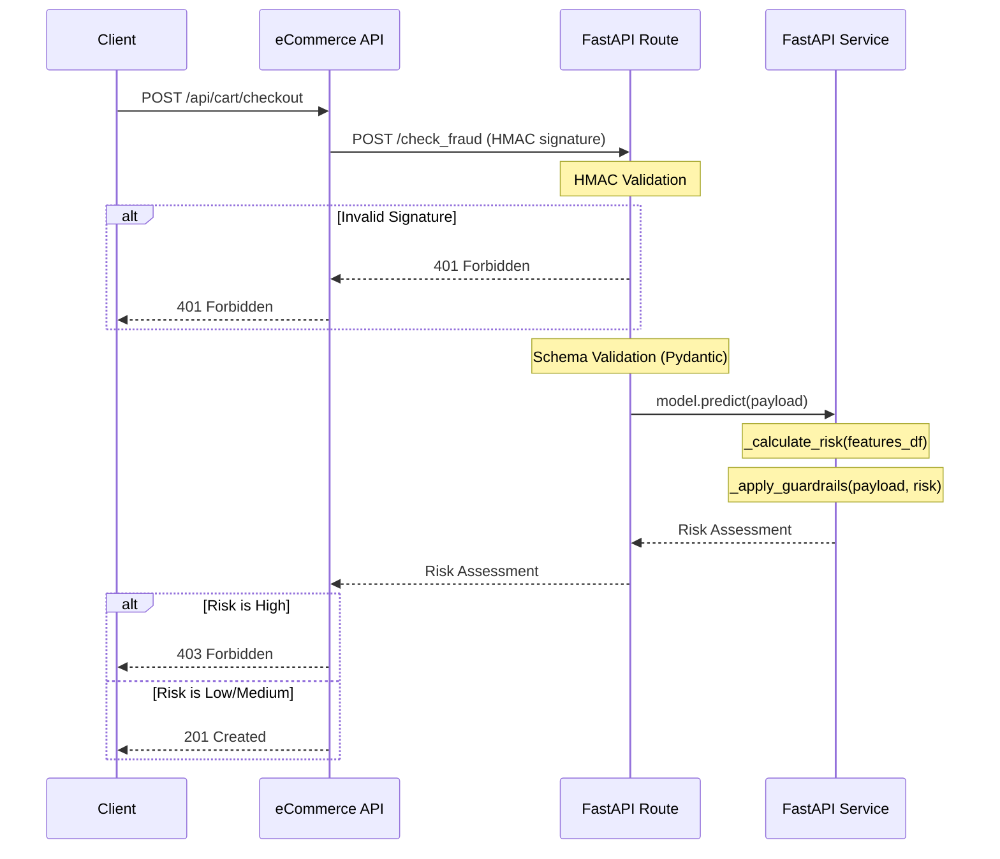

## Overview

A FastAPI-based fraud detection microservice designed to integrate with my Flask eCommerce API project found [here.](https://github.com/ncokic/flask-ecommerce-api) <br>
The service evaluates incoming orders and returns a risk assessment score based on a combination of a trained ML model and rule-based guardrails.

## Tech Stack

- **Backend:** Python, FastAPI, Pydantic
- **ML:** scikit-learn (RandomForest)
- **Data:** pandas, NumPy
- **Architecture:** service layer + dependency injection
- **Infrastructure:** Docker
- **Security:** HMAC signature validation
- **Testing:** Pytest

## Installation & Setup

### Option 1: Local Development

Use this method if you want to test the Fraud Service logic or run the test suite without having to launch the entire eCommerce ecosystem.

```bash
# 1. Clone the repo:
git clone https://github.com/ncokic/fastapi-fraud-check-microservice.git
cd fastapi-fraud-check-microservice

# 2. Create and activate a virtual environment:

# macOS/Linux
python -m venv venv
source venv/bin/activate

# Windows
python -m venv venv
venv\Scripts\Activate.ps1

# 3. Install dependencies:
python -m pip install -r requirements.txt

# 4. Create your environment file (see .env.example for key requirements):
cp .env.example .env

# 5. Run the server:
fastapi run app/main.py --port 8080
```

To test the `/check_fraud` endpoint directly via Swagger UI Docs you must provide a valid `X-Signature` header. A utility script is provided in `scripts/generate_hmac_signature.py` to generate this signature for a given payload. Use the printed signature in your request headers and keep in mind that the `CUSTOM_PAYLOAD` constant and the actual payload being sent in the request must match exactly due to HMAC sensitivity.

### Option 2: Docker

This microservice was designed to be orchestrated alongside the Flask eCommerce API. To run the entire system (Flask App, Database, FastAPI Fraud Service) using Docker Compose, please follow the [Integrated Docker Setup Instructions here.](https://github.com/ncokic/flask-ecommerce-api?tab=readme-ov-file#option-1-docker-recommended)

## Architecture

This microservice is designed to be consumed by my [Flask eCommerce API](https://github.com/ncokic/flask-ecommerce-api) during order checkout. Below is a sequence diagram that highlights how FastAPI microservice handles the data once a request arrives from the Flask app.
- Checkout triggers fraud check request
- Payload includes user + order metadata
- Service returns risk assessment (low/medium/high), risk score (0-1) and forced risk change reasoning (if any guardrails were triggered)
- Flask app decides whether to accept (low risk), accept + flag (medium risk) or deny the order (high risk).

For a more detailed overview of how Flask app checkout triggers this risk assessment see the sequence diagram [here.](https://github.com/ncokic/flask-ecommerce-api/blob/main/README.md#architecture)



Key architectural decisions:

- **Isolated Service Layer** for decoupling the FastAPI routing logic from the scikit-learn logic, allowing for model swaps without changing the API code.
- **Pydantic** strict schema enforcement that acts as a link between the Flask gateway and ML engine.
- **Lifespan function** for managing model initialization via `app.state`.
- **Dependency Injection** leverages FastAPI's `Depends` for header verification and shared resources (like the ML model), making the code more modular and easier to test.

## Key Highlights

### HMAC Security

Microservice only accepts signed requests from the Flask eCommerce app. Requests are signed and verified using HMAC SHA-256 signature validation to ensure authenticity and integrity of incoming data.

### Strict Schema Enforcement

Leveraging Pydantic, the API ensures any malformed data from the client is rejected before hitting the model calculation, preventing the ML layer from processing invalid inputs.

### Locally Trained ML Model

The current API implementation utilizes a scikit-learn RandomForest locally trained model. It uses SMOTE (Synthetic Minority Over-sampling Technique) to address class imbalance in the training data (data is not included in the repo due to file size limits, raw CSV file can be downloaded [here](https://www.kaggle.com/datasets/mlg-ulb/creditcardfraud)). <br>
The model and scaler are lazily loaded into the application state via a FastAPI lifespan function, ensuring fast startup times.

### Hybrid Decision Engine

This microservice is using a combination of ML prediction and rule-based overrides (guardrails) for model edge cases and blindspots.

### Docker Setup

The microservice is fully containerized and supports both standalone endpoint testing as well as integrated testing within the shared bridge network.

---

## Testing

- **97% Code Coverage:** 17 tests that cover unit tests for fraud decision logic (model + guardrails) and integration tests for check_fraud endpoint, validation and signature security. <br>
- **Fully mocked ML layer:** enables a more test-friendly design thanks to using dependency injection for ML model and scaler which improves test reliability without depending on joblib.

## API Documentation

Once the service is running, interactive Swagger UI API documentation is automatically generated and available at:

- **Swagger UI:** `http://localhost:8080/docs`
- **ReDoc:** `http://localhost:8080/redoc`

It is worth noting that the app's home endpoint also redirects to the Swagger UI documentation.

## Project Goals

The ML model included is a proof-of-concept trained on synthetic data. The primary goal of this project is to practice:

- loading and integrating a trained model
- API communication
- microservice integration
- Docker container orchestration 

rather than state-of-the-art predictive accuracy.

## Future Improvements

- introduce async processing / background workers for ML model calculations
- expand to multiple models to support future projects

## Contact

If you have any questions about the project feel free to reach out:

[](mailto:ncokic248@gmail.com)